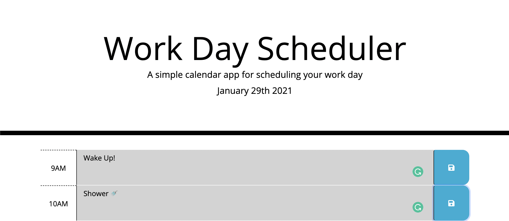

# Work Day Scheduler

## Description

A simple calendar application that allows users to save events for each hour in the day. Using jQuery to dynamically update HTML and CSS, and moment.js library for date and time.

## Table of Contents

* [License](#license)
* [Installation](#installation)
* [Usage](#usage)
* [Credits](#credits)
* [Contributions](#contributions)
* [Tests](#tests)

## License
    

## Installation

Download a zip or clone the original repo. 

## Usage

You can run this app locally by opening up `index.html` in your browser, or check out the deployed version [here](https://rawagschal.github.io/scheduler/).

## Credits

[Moment.js Docs](https://momentjs.com/docs/#/displaying/) and [@Xandromus](https://github.com/Xandromus) for the template.

## Contributions

Fork it, or open an issue on the original repo.

## Tests

This application does not have any tests.

## Contact

Questions, comments, or conerns? Find me on [GitHub](https://github.com/rawagschal/) or [send me an email](mailto:rawagschal@gmail.com).